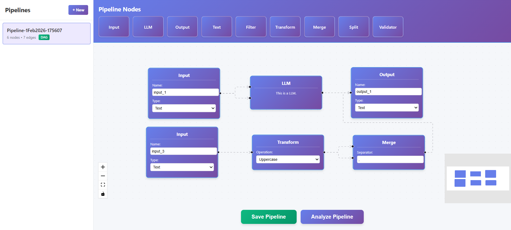

# Pipeline Builder

A visual pipeline builder application with drag-and-drop nodes, real-time validation, and DAG detection.



## 📋 Table of Contents

1. [Features](#features)
2. [Installation](#installation)
3. [Usage](#usage)
4. [Available Nodes](#available-nodes)
5. [Architecture](#architecture)
6. [API Reference](#api-reference)
7. [Technologies](#technologies)
8. [Testing](#testing)

---

## ✨ Features

- **Visual Pipeline Builder** - Drag-and-drop interface for creating data pipelines
- **9 Node Types** - Input, Output, LLM, Text, Filter, Transform, Merge, Split, Validator
- **Dynamic Text Nodes** - Auto-detects variables (`{{variableName}}`) and creates handles
- **DAG Validation** - Detects cycles and validates pipeline structure
- **Pipeline Management** - Save, load, update, and delete pipelines
- **Real-time Dashboard** - View all saved pipelines with metadata
- **Responsive Design** - Mobile-friendly interface
- **Custom Modals** - Professional success/error/warning feedback

---

## 🚀 Installation

### Prerequisites

- Node.js (v14+)
- Python 3.8+
- npm

### Setup

**1. Clone Repository**

```bash
git clone <repository-url>
cd pipeline-builder
```

**2. Install Frontend Dependencies**

```bash
cd frontend
npm install
```

**3. Install Backend Dependencies**

```bash
cd backend
pip install -r requirements.txt
```

### Running the Application

**Start Backend** (Terminal 1)

```bash
cd backend
uvicorn app:app --reload
```

Backend: http://localhost:8000

**Start Frontend** (Terminal 2)

```bash
cd frontend
npm start
```

Frontend: http://localhost:3000

---

## 📖 Usage

1. **Drag nodes** from toolbar onto canvas
2. **Connect nodes** by dragging from output (right) to input (left) handles
3. **Configure nodes** using input fields
4. **Save pipeline** - Click "Save Pipeline" and enter name
5. **Load pipeline** - Click pipeline in sidebar
6. **Analyze pipeline** - Click "Analyze Pipeline" to validate

### Text Node Variables

Type `{{variableName}}` in Text nodes to create dynamic input handles:

```
Input: "Hello {{name}}, your {{status}} is ready"
Result: Creates 2 handles - "name" and "status"
```

---

## 🔧 Available Nodes

1. **Input** - Data input with name and type selection
2. **Output** - Data output with name and type selection
3. **LLM** - Language model with system and prompt inputs
4. **Text** - Dynamic text with variable detection
5. **Filter** - Conditional filtering (contains, equals, startsWith, endsWith)
6. **Transform** - Text transformations (uppercase, lowercase, trim, reverse)
7. **Merge** - Combine two inputs with separator
8. **Split** - Split input into two outputs
9. **Validator** - Data validation (email, URL, phone, number)

---

## 🏗️ Architecture

### Project Structure

```
pipeline-builder/
├── backend/
│   ├── app.py                   # Main entry point
│   ├── config/                  # CORS configuration
│   ├── models/                  # Pydantic schemas
│   ├── routes/                  # API endpoints
│   └── utils/                   # Business logic
│
├── frontend/
│   ├── src/
│   │   ├── components/         # UI components
│   │   ├── nodes/              # Node components
│   │   ├── hooks/              # Custom hooks
│   │   ├── utils/              # Services & helpers
│   │   └── constants/          # App constants
│   └── package.json
│
└── README.md
```

### Backend Architecture

```
Entry Point (app.py)
    ↓
Routes (API endpoints)
    ↓
Models (Validation)
    ↓
Utils (Business logic)
    ↓
Config (Middleware)
```

### Frontend Architecture

```
App (Root)
    ↓
Layout Components (Toolbar, UI, Submit)
    ↓
Feature Components (Nodes, Modal)
    ↓
Hooks & Utils (Logic & Services)
    ↓
Store (State Management)
```

### Design Patterns

**Backend:**

- Repository Pattern
- Factory Pattern
- Dependency Injection

**Frontend:**

- Component Composition
- Custom Hooks
- Service Layer
- CSS Modules

---

## 📡 API Reference

### Pipeline Endpoints

**Save Pipeline**

```
POST /pipelines/save
Body: { name, nodes, edges }
Response: { status, message, pipeline_id }
```

**Update Pipeline**

```
PUT /pipelines/{id}
Body: { name, nodes, edges }
Response: { status, message, pipeline_id }
```

**List Pipelines**

```
GET /pipelines/list
Response: [{ id, name, num_nodes, num_edges, is_dag, created_at, updated_at }]
```

**Get Pipeline**

```
GET /pipelines/{id}
Response: { id, name, nodes, edges, num_nodes, num_edges, is_dag, created_at, updated_at }
```

**Delete Pipeline**

```
DELETE /pipelines/{id}
Response: { message }
```

**Analyze Pipeline**

```
POST /pipelines/parse
Body: { nodes, edges }
Response: { status, message, num_nodes, num_edges, is_dag, warnings }
```

### Database

- SQLite (`pipelines.db`) with SQLAlchemy
- Auto-created on first run
- Clear database: `python backend/clear_db.py`

---

## 🛠️ Technologies

**Frontend:**

- React 19
- ReactFlow 11
- Zustand (state management)
- CSS Modules

**Backend:**

- FastAPI
- Pydantic (validation)
- SQLAlchemy (ORM)
- Python 3.8+

---

## 🧪 Testing

### Frontend Tests

```bash
cd frontend
npm test
```

**Coverage:**

- Store (state management)
- Modal components
- Sidebar operations
- Custom hooks
- Node components
- API service layer

### Backend Tests

```bash
cd backend
pytest -v
```

**Coverage:**

- DAG validation
- API endpoints
- CRUD operations
- Data models

---

## 🎨 Key Features

### BaseNode Abstraction

Create new nodes in ~20 lines:

```javascript
import { BaseNode } from "./BaseNode";

export const CustomNode = ({ id, data }) => {
  const config = {
    title: "Custom",
    initialState: (id, data) => ({ value: "" }),
    renderContent: ({ state, updateState, inputClass, labelClass }) => (
      <label className={labelClass}>
        Value:
        <input
          value={state.value}
          onChange={(e) => updateState("value", e.target.value)}
          className={inputClass}
        />
      </label>
    ),
    handles: {
      target: [{ id: "input" }],
      source: [{ id: "output" }],
    },
  };
  return <BaseNode id={id} data={data} config={config} />;
};
```

### Dynamic Text Nodes

- Width: 200px to 400px based on content
- Height: Adjusts based on lines
- Variable detection: `/\{\{\s*([a-zA-Z_$][a-zA-Z0-9_$]*)\s*\}\}/g`
- Creates dynamic handles for each variable

### DAG Validation

- DFS cycle detection
- Disconnected node detection
- Performance warnings (100+ nodes, 200+ edges)
- Empty pipeline validation

---

## 📱 Responsive Design

- Mobile-friendly layout
- Breakpoint: 768px
- Flexbox and CSS Grid
- Touch-optimized controls
- Responsive typography

---

## 🎨 Design System

**Colors:**

- Primary: `#667eea` to `#764ba2`
- Success: `#10b981` to `#059669`
- Error: `#ef4444` to `#dc2626`
- Warning: `#f59e0b` to `#d97706`

**Features:**

- CSS Modules for scoped styling
- Gradient backgrounds
- Smooth animations
- Professional UI/UX

---

## 📝 Notes

- Use `uvicorn app:app --reload` to start backend
- CORS configured for localhost:3000
- Database auto-created on first run
- All nodes use BaseNode abstraction
- Purple gradient theme throughout

---

## 🤝 Contributing

Feel free to fork this project and submit pull requests!

---

## 📄 License

MIT License - feel free to use this project for learning and practice.
